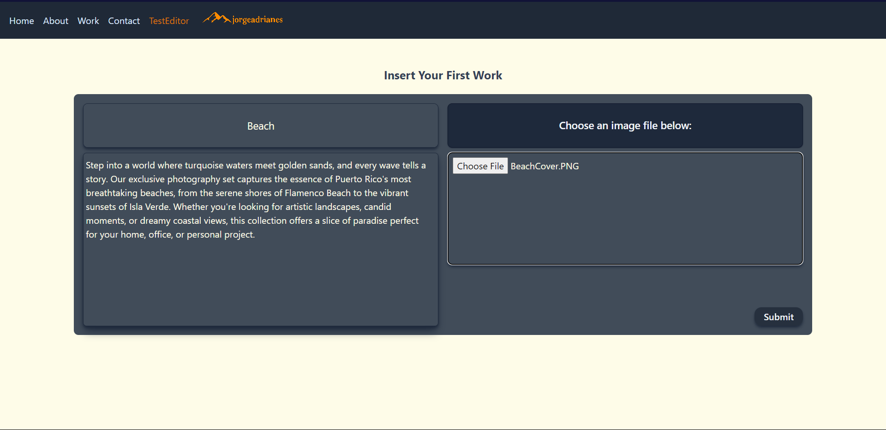
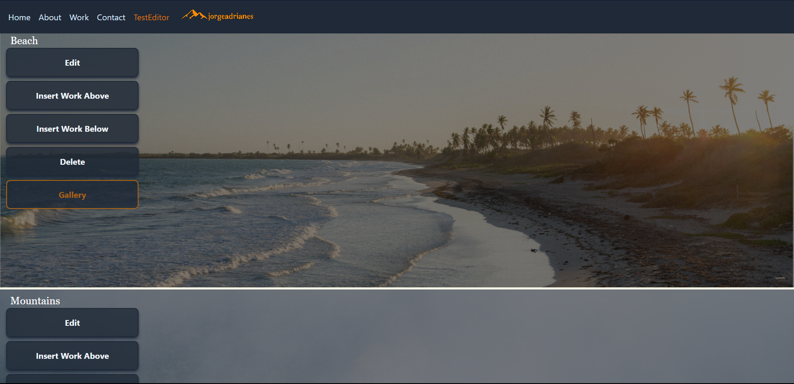
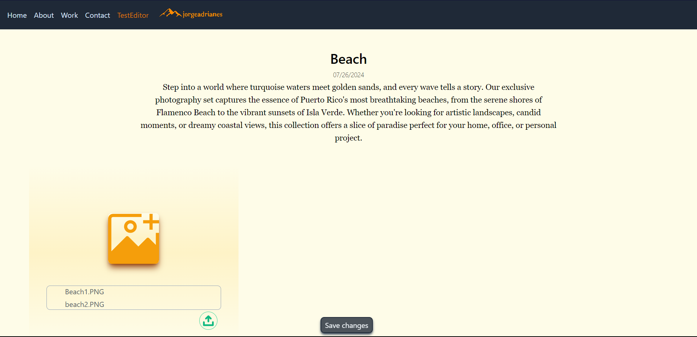
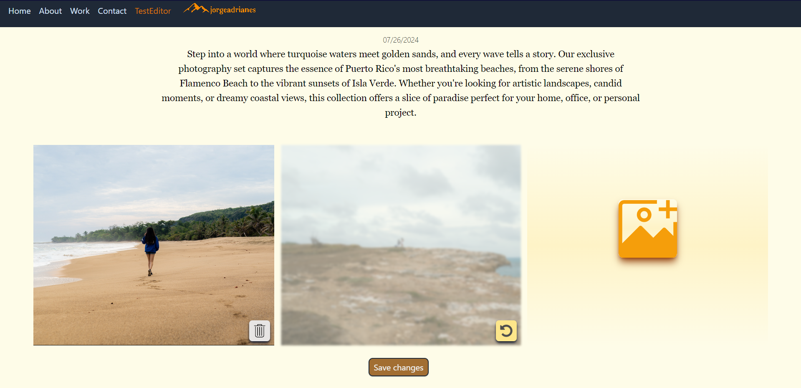
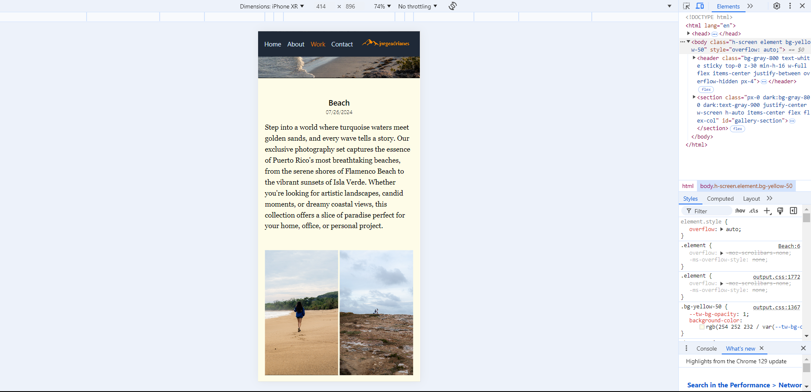
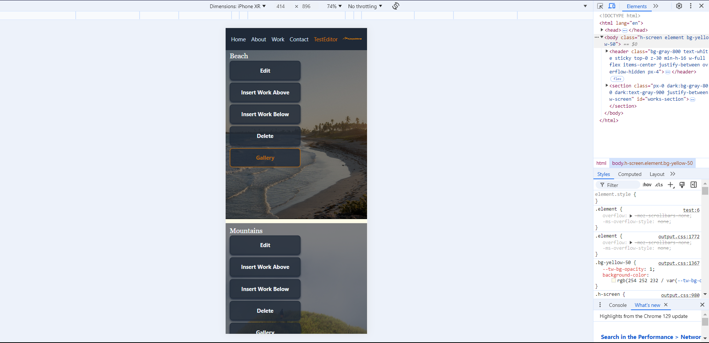
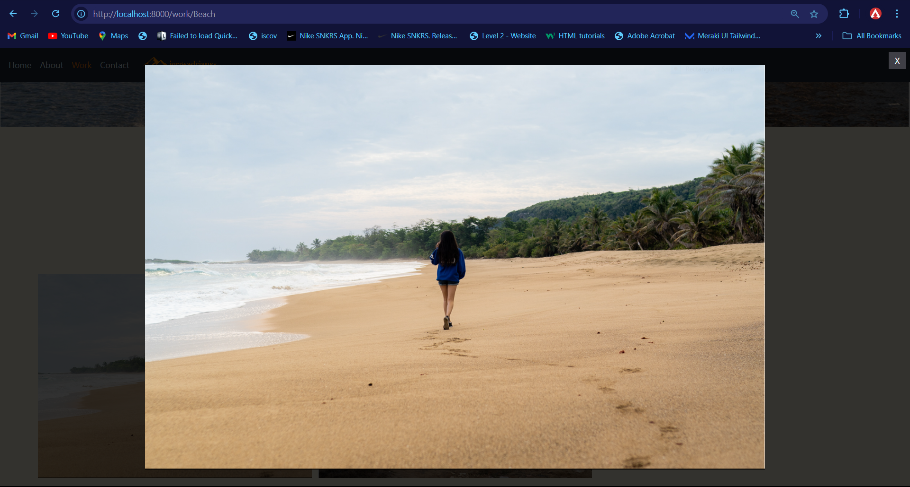
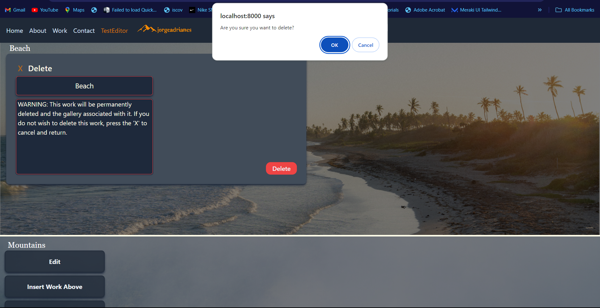

# Go_htmx_page

WORK IN DEVELOPMENT - Page for a photographer's portfolio - WORK IN DEVELOPMENT

## Overview

This project is a dynamic portfolio page for a photographer, built using Go, HTMX, TailwindCSS, Supabase, and .templ. It allows for showcasing the photographer's work, with features for editing and managing the content.

## Technologies Used

- **Go**: Backend development
- **HTMX**: Frontend interactions and dynamic content
- **TailwindCSS**: Styling and layout
- **.templ**: Templating engine
- **Supabase**: Database management

## Features

- Responsive Design
- Dynamic Content
- Editor Mode for Admin Management
- Editing Availabe on Mobile
- Picture Integration with Supabase Buckets

# The Product

Work in progress, some images below:

  
  
  
  
  
  
  
  

